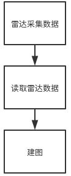
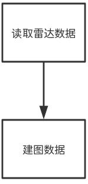

# 需求分析报告

## 1 引言
### 1.1 编写目的
随着科技的发展，国民生活水平的提高，越来越多的智能家居被应用到线上。像生活每天意外掉落的食物残渣，空气中飘落的灰尘，甚至是宠物脱落的毛发都让我们不得不抽出时间进行清扫。对于瓷砖、木质地板会用到扫把，而像客厅地毯这种更容易藏污纳垢的地方就需要吸尘器出手，下至几十上至几百平米的房间不仅需要打扫，还得用拖把擦拭一遍。为了解放我们的双手不浪费时间和精力，扫地机器人已经逐渐代替手持吸尘器成为了更好的选择。扫地机器人作为智能家居的一种，受到广泛的关注。扫地机器人主要运用到的技术是环境建模与路径规划。我们将毫米波雷达作为扫地机器人的传感器对周围的环境进行建模。室内服务机器人是当下热门的研发方向。酒店服务机器人、智能扫地机器人等都是在这个方向中涌现出来的产品。当下的智能室内服务机器人市场有着极大的缺口，吸引着众多有着技术实力的公司来开发相关的产品。但是，纵观目前市场上的产品，我们会发现一些显著的问题。这些问题主要体现在用户体验方面，例如扫地机器人扫地时经常会被家中地面上的电线缠绕，或者对于宠物的粪便无法进行有效的避让或清理。这些体验上的瓶颈有着技术上的原因，也有出于用户隐私的考虑，因为如果在扫地机器人上安装一个摄像头就能够轻易的识别电线和宠物粪便了，但是这又会使用户产生隐私上的顾虑。总的来说，目前国内的智能扫地机器人市场巨大，但是市面上的产品还没有达到十分成熟的阶段。撇开室内服务机器人的服务属性来看，我们可以看到这类机器人共同需要的一个技术点就是SLAM，即实时定位和建图。因此，构建一个成熟、稳定的SLAM系统将会给这类机器人的开发提供极大的便利，从而撬动巨大的市场。
### 1.2 适用范围
本文档适用于系统的开发者和系统的使用者进行阅读。
### 1.3 背景
#### 人工智能的高速发展
随着科技的高速发展,人工智能技术已成为目前研究和应用的热点。人工智能是计算机科学的一个分支，它企图了解智能的实质，并生产出一种新的能以人类智能相似的方式做出反应的智能机器。人工智能技术与其他多种技术形成的新型交叉技术已广泛应用于医疗,餐饮,交通,家居等多个行业。
#### 智能家居的兴起
智能家居是在互联网影响之下物联化的体现。智能家居通过物联网技术将家中的各种设备连接到一起，提供房间内各个家居的控制。除此之外，智能家居不仅只对原有的家居进行了改善，也将生活中的一些家用工具进行了改善，使他们也成为智能家居中的一员。
####　毫米波雷达的广泛应用
一直以来，地面清扫工作就是我们头痛的家务事，先扫再拖，繁琐又费力。随着科技的进步，人们开始选择用富含高科技的扫地机器人来解决地面清扫难题，效果十分不错。目前，市场上的扫地机器人主要将激光雷达作为传感器，对周围的环境进行建模。相比于激光雷达，毫米波雷达穿透雾、烟、灰尘的能力强，具有全天候全天时的特点，可以在复杂的环境中进行建图。由于工作频率高，可能得到大的信号带宽（如吉赫量级）和多普勒频移，有利于提高距离和速度的测量精度和分辨能力并能分析目标特征。
### 1.4 定义
ROS:机器人操作系统
ssh:安全外壳协议

## 2 任务概述
### 2.1 开发目标
该软件系统可以启动毫米波雷达，雷达采集到周围环境的数据后将数据发送给扫地机器人。扫地机器人接收到数据以后对周围环境进行实时建图，建图完毕后根据地图数据进行自动寻路。利用DSS模块将雷达的波信号转换为识别的环境信息，利用MSS模块将环境信息进行过滤。嵌入式设备通过通过UART串口通讯读取雷达采集的数据。再将采集到的数据进行建图。嵌入式的系统主要是在Ubuntu系统下的ROS软件平台上进行开发，数据间的通信通过ROS的话题/消息机制。
### 2.2 应用目标
能让扫地机器人根据周围的环境建出对应的地图，并根据地图更灵活的在环境中运行。

## 3 功能需求
### 3.1 概述
本系统使用毫米波雷达作为传感器采集环境数据并进行建图，因此，该系统的功能主要分为四步：首先，雷达采集周围数据；其次，嵌入式设备通过串口读取雷达数据；再次，嵌入式设备处理这些数据并进行建图；最后，机器人根据所建地图进行路径规划。

### 3.2 雷达采集数据
毫米波雷达通过发送和接收正弦波来测量周围环境中物体的位置与速度，并将信息转换成点云信息。在启动雷达后，雷达需要根据其工作原理发送、接收毫米波，并根据波的信息将波信号转换为电信号，再进一步将电信号转换成点云信息。由于有些雷达波会反射多次后才会被雷达板所接收，因此会存在一些杂波生成的噪声点云信息，在雷达采集数据的时候也需要将这些噪声点进行过滤。
### 3.3 读取雷达数据
在雷达得到点云信息以后，由于雷达板上处理器的处理速度无法直接进行建图，因此需要将点云信息通过串口发送到嵌入式设备中。因此，嵌入式设备需要根据雷达的数据格式读出雷达所表达的点云信息。并将这些点云信息转换为建图需要的信息。
### 3.4　建图
在嵌入式设备获得雷达所表达的点云信息以后，需要每帧对采集到的点云信息进行处理，将这些点云信息建立成地图。传入的点云信息可能会对已建好的部分进行更新，也可能是建立未建好的部分。但在将点云信息插入到地图信息之前，需要确定雷达在地图中的位置，通过雷达与机器人位置的转换，以及机器人与地图位置的转换，将雷达获取的点插入到地图中，更新整个地图信息。

### 3.5 数据传输
数据的传输主要在两部分。第一部分是雷达采集数据与读取雷达数据之间的数据传输，第二部分是将读取后的数据转换为建图数据之间的数据传输。在第一部分中，由于读取雷达数据后要对雷达数据进行数据转换，因此要将雷达通过串口发送过来的数据进行实时的处理，防止数据阻塞。同样的，在第二部分中，处理完雷达数据以后需要将雷达数据插入到地图中，因此也需要实时的处理，防止数据阻塞。

## 4 非功能需求
### 4.1 性能需求
由于雷达获取的数据是在机器人在运动过程中获得的数据，因此从雷达获得数据到建图的过程中需要很短的时间，这样才能防止机器人撞在未在建图数据上的障碍物。
### 4.2 数据准确度
数据的准确度主要包括两个方面的数据。第一个方面是雷达获取数据的准确度，雷达在发出毫米波之后，由于有的波可能会反射多次后再被雷达接收到，这样的杂波会影响雷达采集的数据信息。第二个方面是建图的信息，在将处理分析完的点插入到地图之前，需要获得机器人在地图中的位置，但是由于机器人会移动，因此机器人在地图中的位置会变得不准确，这样会影响建图的数据。
### 4.3 安全需求
机器在移动的时候，速度不能过快，否则撞到未检测到的物体时会损坏环境或机器人本身。
### 4.4 灵活性
无论是接口的实现还是数据的设计，我们的设计都要具有通用性，这样在使用其他类型的数据或者使用数据做其他事情的时候，我们可以及时的改进系统。

## 5 运行环境规定
### 5.1 硬件设备
雷达：TI IWR6843ISK  
嵌入式设备内存：8GB及以上  
嵌入式设备CPU：Intel Core i5及以上  
网卡：10M
机器人：Turtlebot 2  
### 5.2 软件支持
操作系统：Ubuntu 16.0  
软件平台：Robot Operating System(ROS)  
开发语言：c、c++、python
网络通信：SSH  
### 5.3 控制
主要是由鼠标和键盘远程启动嵌入式设备中的雷达和建图功能。

 